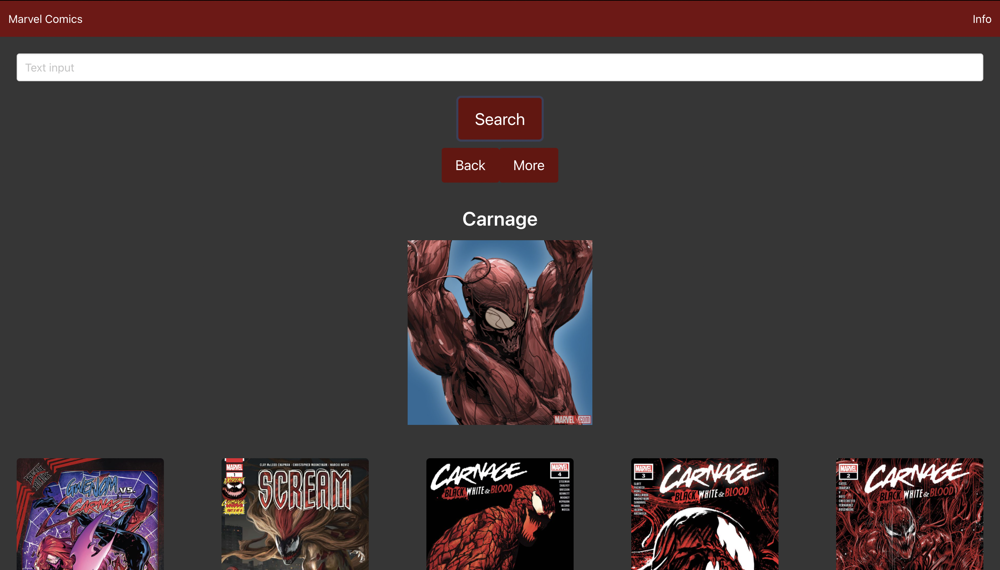
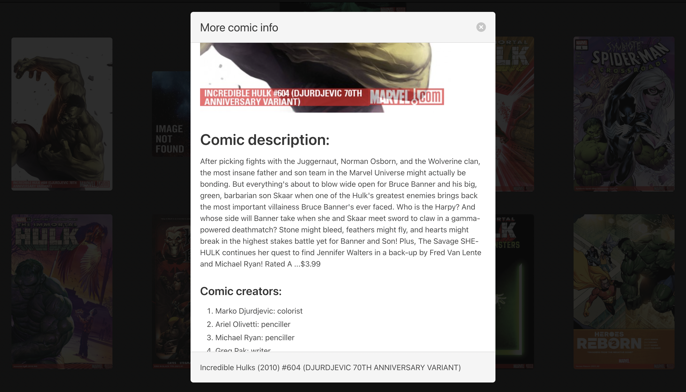

<h1 align="center">Marvel Api</h1> 
  
[LinkedIn]: https://www.linkedin.com/in/jason-barrera-ramirez-b2a473204/

[MIT]: https://choosealicense.com/licenses/mit/
## Summary
This is a website that is based on a previous project worked on by me and other collaborators. It has been revamped and given a better look for mobile view. It takes in a hero or villain input and displays comics for that character through the use of an api.
## Table of Contents
- [Usage](#usage)
- [Credits](#credits)
- [License](#license)
- [Challenges](#challenges)
- [Technologies](#technologies)
- [Future development](#future-development)
- [How to contribute](#how-to-contribute)
- [Tests](#tests)
- [Questions](#questions)
## Usage
You input a hero/villain name based in the marvel universe into the search bar and you must click search or enter for your hero/villain to be searched. You then are displayed with 10 comics for that character, for each displayed comic if you click on any it will display a modal with more information on the comic and the contributors of the comic.
### Character searched

### Displayed comics

### Opened modal

### Comic creators/characters
Some comics did not have a desription so the description block appears blank.

### Working comic description
This shows that the comic description block does work with comics that have a description available.

## Credits
Jason Barrera-Ramirez  
[][LinkedIn]  
## License
This Project is covered by the [MIT] license
## Challenges
The main challenge for this revamped project was figuring out a good layout that would look good on both desktop and mobile. Another challenge was figuring out a good color contrast in order to achieve accessiblity for a broader audience. A big issue was the spelling for some heros, based on the Api some of the characters names are there actual name and not their aliases so it sometimes does not recognize a character name unless its their birth name.
## Technologies

  

## Features
This site allows for you to look for any character in the marvel universe. It also has a good interface for mobile view.
## Future Development
Be able to search for more than just 20 comics at a time and implement page buttons.
## How to Contribute
Fork the Repo and make a pull request for code to be reviewed and considered for merge to main branch.
## Tests
There are no tests available for this project.
## Questions
If there are any questions about the project get in contact with me at my [Email](mailto:jason1287712@gmail.com)

